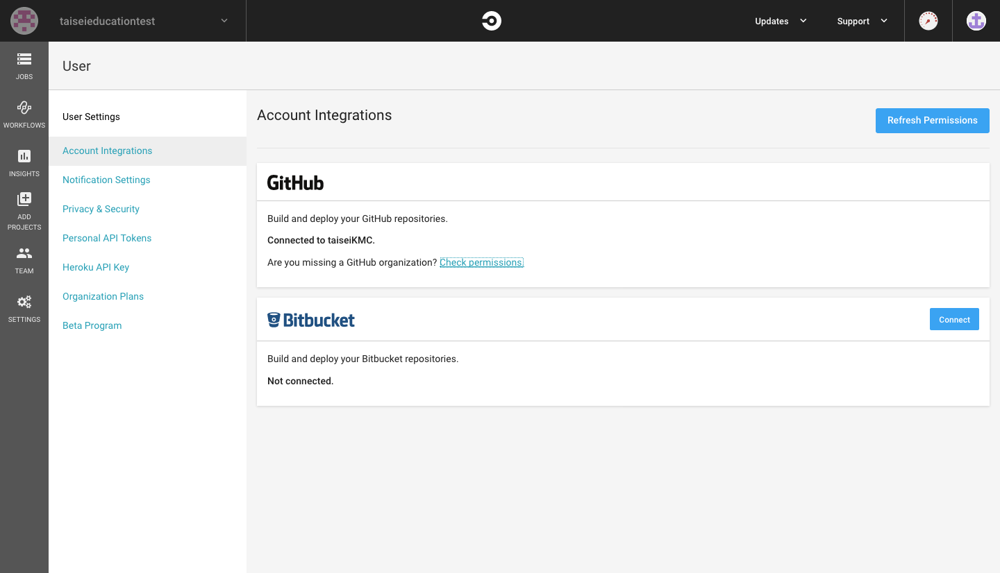
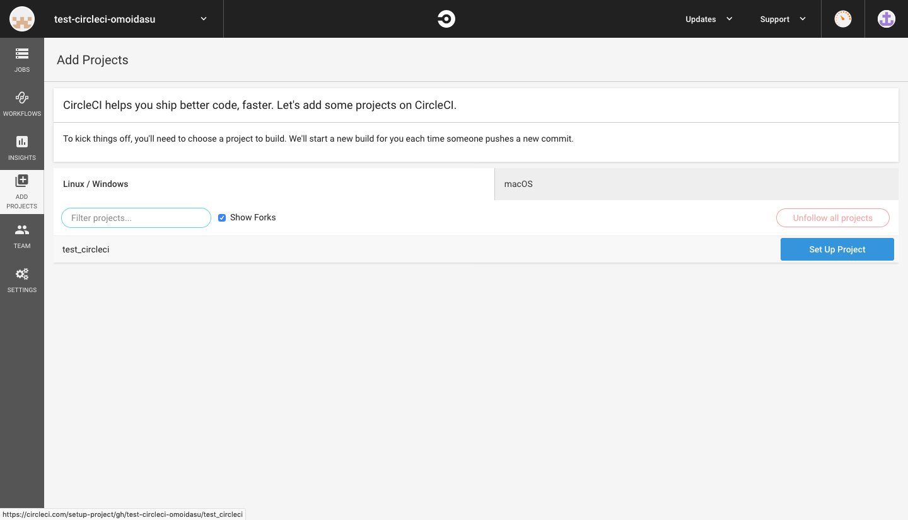

# Github Classroom の為の Circle CI 設定

## TL;DR
- organization を作って circle ci と連携する
- github classroom で生えた学生の repository は circle ci から ADD PROJECT する

## 連携編
1. Github で organization を作ります
    - ここに学生の repository を作ります
2. fork元となる repository を作成します
    - もちろん owner は 作った organization です
3. 作った repository に課題となるファイルと、circleci の設定ファイルを置きます
    - circleci の設定ファイルは `.circleci/config.yml` です
        - ここに書いた job が circleci 上で実行されます
4. https://circleci.com/ にサインインしてなければサインインします
    - サインインには organization の owner の github アカウントを使用して下さい

5. 右上のユーザーアイコンをクリックして、 [User Settings](https://circleci.com/account) に飛んでください

6. `Account Integrations`のGithubの項目から`Check Permissions`を押すと Github のページに飛ぶので、作った organization の`grant`を選択して下さい

    - これで circle ci のページから organization 内の全ての repository を owner は参照することができるようになります
    - この設定をしなくても自分が作成した repository に関しては circle ci から参照できます

7. circleci のサイトで左上のアイコン(=switch organizations)を押すと、grant した organizations が選べるようになってるはずなので、選び、`ADD PROJECTS`からjobを走らせたい repository の`SETUP PROJECT`を選択します

8. 次の画面で`Start building`を押すと早速ビルドが始まり、以降pushする度に`.circleci/config.yml`に書いたjobが走ります

9. github classroom の設定をします
    - 詳細は省略

10. github classroom で学生が fork して出来た repository が circleci の `ADD PROJECTS` で見える一覧に出てくるはずなので、7,8 を繰り返し行います
    - 一度は手動でやらなければ行けなさそう？
    - 誰かが`SETUP`した repository は他の人は`Follow`というボタンになっていて、押すと job の status が見られます

11. job の status は`JOBS`から見られます

## 設定編
以下は`config.yml`の例です
``` 
version: 2
jobs:
  build:
    docker:
      - image: suginamiku/le3sw:latest
    branches:
      only:
        - master
    steps:
      - checkout
      - run:
          name: Build
          command: |
            eval $(opam env)
            dune build
      - run:
          name: Test
          command: |
            eval $(opam env)
            dune runtest
```
- circleci では docker hub 上のコンテナをビルドに使用出来ます (circleci を使っている最大の理由)
    - 上の例では`suginamiku/le3sw:latest`が該当します
    - 必要なソフトウェアをインストールしたコンテナイメージをアップロードすると良いです
        - インストールするものが少なければ`ubuntu18.04:latest`を入れて`apt install`していくとかでも良いかもしれない
        - もちろん queue は詰まります

- `branches`で job を実行する branch を指定します
    - この例では `master` に push される度に job が実行されます
    - `Only build pull requests`というのもあります

- `steps`に書いたコマンドが上から順に実行されます

詳しくは[公式のドキュメント](https://circleci.com/docs/2.0/configuration-reference/)へ

## 補足
- organization 内の学生の private  repository を参照できるのは owner だけです
- 💴で殴ると`INSIGHTS`が見られるようになります
    -  repository 毎の status が見やすくなるかもしれない
- 無料プランには1並列&1週間で250分の制限があります
- 実行時間が10分を過ぎると自動で終了します 確か